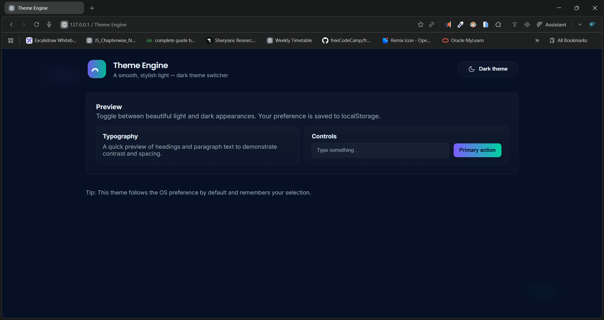

# 🌗 Theme Engine

A smooth, stylish, lightweight **Light ↔ Dark Mode** theme engine with automatic OS-level theme detection and persistent user preference.



---

## 🔗 Live Demo

- 👉 **Live Site:** [https://dileep-kumawat.github.io/Theme-Engine-using-html-css-and-js/](https://dileep-kumawat.github.io/Theme-Engine-using-html-css-and-js/)
- 👉 **Demo Video:** [click to watch](./demo.mp4)

---

## ✨ Features

* 🌓 **One-click theme toggle** (light ↔ dark)
* 🎨 **Beautiful modern UI** with gradients & soft shadows
* 💾 **Saves theme preference** using `localStorage`
* 🖥 **Respects system preference** with automatic switching
* ⚡ **Smooth transitions & button animation**
* 📱 Fully **responsive** and mobile-friendly
* 🔧 Zero dependencies — pure **HTML, CSS, and JavaScript**

---

## 📸 Preview

The interface includes:

* A minimal, modern header with a dynamic theme-toggle button
* A preview card showcasing typography, controls, and contrast
* UI elements such as text fields and CTA buttons styled for both themes

---

## 📦 Project Structure

```
project/
│── index.html     # Main UI markup
│── styles.css     # Light & dark theme variable system + layout styles
└── script.js      # Theme logic, toggle handler, animations
```

---

## 🛠 How It Works

### **1. Theme Variables**

Each theme defines its color system using CSS variables, applied via the `<html>` class:

```css
html.light { ... }
html.dark { ... }
```

The UI updates instantly when the class changes.

### **2. JavaScript Theme Engine**

The script:

* Detects saved preference (`localStorage`)
* Falls back to OS theme using `matchMedia('(prefers-color-scheme: dark)')`
* Updates the UI + icon + label dynamically
* Animates the toggle button for a polished experience

Example (from `script.js`):

```js
btn.addEventListener('click', () => {
    html.classList.contains('dark') ? lightTheme() : darkTheme();
});
```

### **3. Persistent Preferences**

```js
localStorage.setItem('theme', 'light');
```

The user’s selection is remembered across sessions.

---

## 🚀 Getting Started

### **Clone the project**

```bash
git clone https://github.com/Dileep-kumawat/Theme-Engine-using-html-css-and-js.git
cd theme-engine
```

### **Open the project**

Open `index.html` in any modern browser.

That's it — no builds, no dependencies, no setup.

---

## 🧩 Customization

You can easily:

* Change accent colors
* Replace icons
* Modify gradients
* Add more UI elements inside `.preview-grid`

All theme colors live in the `:root`, `html.light`, and `html.dark` sections for quick editing.

---

## 👨‍💻 Author

👤 **Dileep kumawat**
- 📧 [dileepkumawat525@gmail.com](mailto:dileepkumawat525@gmail.com)
- 🔗 [LinkedIn](https://www.linkedin.com/in/dileep-kumawat/)

---

## 📜 License

MIT License — free to use in personal or commercial projects.

---